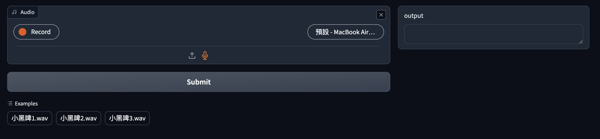

# How to use

## Build your own environment
You can build a virtual env from whatever you want (e.g. conda python-venv).

Then instll require python package `pip install -r requirements.txt`.

## Live demo with Gradio & faster-whisper

You have to convert your whisper model to **ctranslate2** type.

After that, you can run gradio server.

```bash
ct2-transformers-converter --model $source --output_dir ${convert_output_path} --copy_files vocab.json preprocessor_config.json
cd live_demo
python gradio_demo.py --model_path /path/to/ct2_model
```

It will show like this.
<p align="center">
    
</p>

Additionally, you can set example audio for convenience.

```py=
examples=[
    ["path/to/audio1.wav"],
    ["path/to/audio2.wav"],
    ["path/to/audio3.wav"],
    ["path/to/audio4.wav"],
],
```